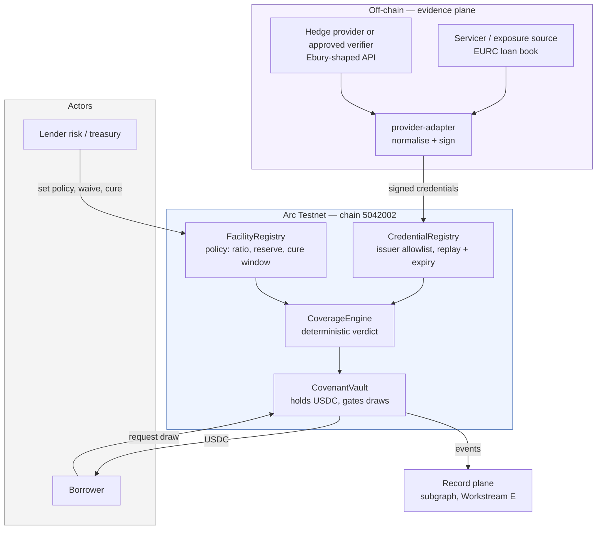
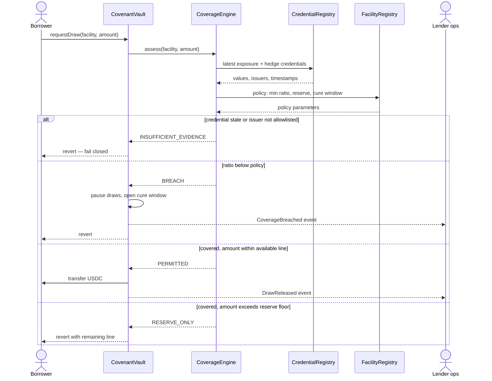
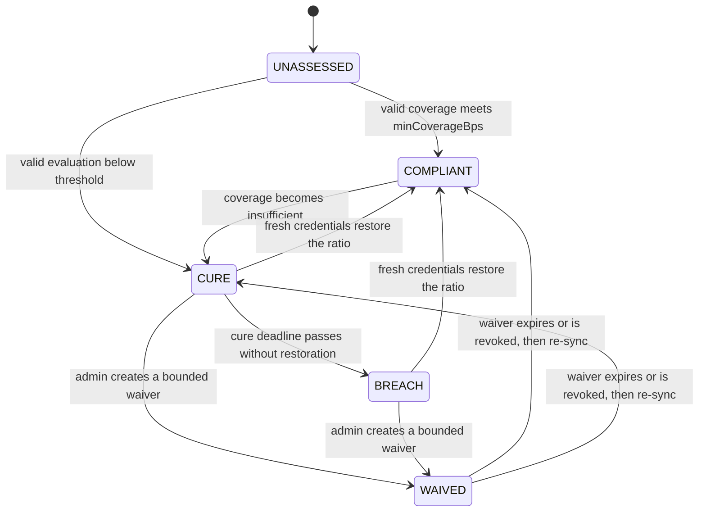
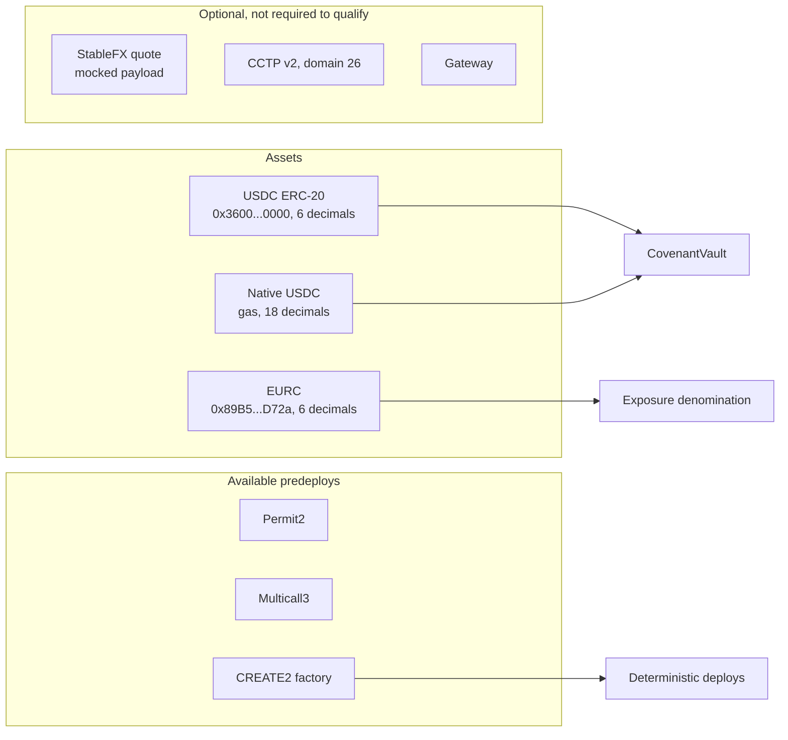

# Arc System Design — Workstream A

**Created:** 2026-09-05
**Status:** Design only. Nothing in here is built or deployed.
**Governing docs:** `SPONSOR-STRATEGY-REVIEW.md` (private) is the north star; `PRODUCT-THESIS.md` (private) controls scope and vocabulary; `ETHONLINE-WORKSTREAMS.md` (private) holds the verified sponsor facts.
**Target:** Arc Testnet, chain ID `5042002`.

## 1. The abstract system

The product is one sentence with four moving parts:

> A lender releases USDC only while an authenticated hedge covers the borrower's non-USD exposure.

Everything below is an implementation of four planes. The planes are technology-agnostic on purpose — the same design must survive being re-targeted at Base, and must not assume Arc, Circle, or any single verifier.

| Plane | Question it answers | Trust source | Arc binding |
|---|---|---|---|
| **Evidence** | What is the exposure, and what hedge exists against it? | Two independent authorized issuers | Signed credentials from an exposure issuer and a hedge issuer |
| **Decision** | Given policy, is this facility covered right now? | Deterministic, onchain, no discretion | `CoverageEngine` |
| **Capital** | May this drawdown leave? | Lender policy, enforced not advised | `CovenantVault` holding USDC |
| **Record** | What was true at the moment capital moved? | Immutable event history | Arc logs, indexed later |

The invariant that makes it a control layer rather than a dashboard: **the capital plane cannot be satisfied by the decision plane's opinion alone — it requires a fresh, unexpired, correctly-issued credential from the evidence plane.** A stale credential fails closed.

## 2. System context

**Why two issuers.** A single source that reports both the exposure and the hedge can always report coverage. Independence is the whole product: the servicer says what is owed, the verifier says what is hedged, and neither can unilaterally unlock capital. This is `PROTOTYPE-SPEC.md`'s "two independently authorized sources," and on Arc it must be **two distinct addresses**, never one key wearing two hats.

## 3. The drawdown path

**Fail-closed is the design.** Missing evidence is not "assume covered"; it is refuse. That single choice is what a credit officer is buying.

## 4. Facility lifecycle

These are the canonical states from `PROTOTYPE-SPEC.md` §8, not new vocabulary. Draws are allowed only in `COMPLIANT` or under an active `WAIVED`; entering `CURE` blocks draws immediately, because a cure period is time to remedy, not permission to add exposure. `BREACH` adds no liquidation or seizure behaviour. Every transition emits an event, and that event stream *is* the auditable policy history the thesis claims — and the input to Workstream E.

## 5. Arc-specific bindings

**The decimals hazard, stated once and loudly.** Arc's native gas USDC is **18 decimals**; the ERC-20 interface over that same balance at `0x3600000000000000000000000000000000000000` is **6 decimals**; EURC is **6 decimals**. Our coverage ratio divides an exposure amount by a hedge amount, and the existing code assumes 6 throughout. A mixed-decimal ratio does not throw — **it silently returns a wrong verdict**, which in this product means releasing capital that should have been paused. Mitigation: a single normalisation boundary at the credential layer, every amount carried with its decimals, and a failing test written *before* the port.

## 6. Dependency list

### Chain and network
| Dependency | Value | Status |
|---|---|---|
| Arc Testnet chain ID | `5042002` / `0x4CC1B2` | Verified |
| RPC | `https://rpc.testnet.arc.io` | Verified |
| Explorer | `https://testnet.arcscan.app` | Verified |
| Faucet | `https://faucet.circle.com` | Verified |
| Gas token | Native USDC, 18 decimals | Verified |
| Mainnet | Launches 2026-09-16; addresses not yet published | Verified |

### Contracts we consume
| Dependency | Address | Decimals |
|---|---|---|
| USDC ERC-20 interface | `0x3600000000000000000000000000000000000000` | 6 |
| EURC | `0x89B50855Aa3bE2F677cD6303Cec089B5F319D72a` | 6 |
| Permit2 | `0x000000000022D473030F116dDEE9F6B43aC78BA3` | — |
| Multicall3 | `0xcA11bde05977b3631167028862bE2a173976CA11` | — |
| CREATE2 factory | `0x4e59b44847b379578588920cA78FbF26c0B4956C` | — |
| CCTP v2 TokenMessenger | `0x8FE6B999Dc680CcFDD5Bf7EB0974218be2542DAA` | domain 26, optional |

### Contracts we ship
Existing, locally tested, to be ported: `FacilityRegistry`, `CredentialRegistry`, `CoverageEngine`, `CovenantVault`, plus a EURC-shaped mock for local runs.

### Off-chain packages
`packages/credentials` (schema, signing, verification), `packages/provider-adapter` (Ebury-shaped normalisation + fixtures), `apps/dashboard` (operator view), `scenarios/` (replayable facility run).

### Identities — four distinct addresses, no reuse
`deployer` · `admin` (policy) · `exposureIssuer` · `hedgeIssuer`. The two issuers must never share a key, or the independence property is fiction.

### Toolchain
Foundry, pnpm workspace, TypeScript, Vite. Arc targets the Osaka EVM baseline with documented divergences — check the divergence list before assuming any opcode-level behaviour.

### External, optional
StableFX TEST key (rep-gated, mocked instead) · App Kit · Gateway.

## 7. Build order

1. Decimals normalisation + failing test.
2. Deploy the four contracts to Arc Testnet via CREATE2; record a deployment manifest.
3. Issue exposure and hedge credentials from two distinct keys; prove a stale credential fails closed.
4. Fund the vault with ERC-20 USDC; run the happy path; run the breach path; run cure.
5. Dashboard reads the manifest; shows verdict, ratio, available line, and the receipt for every state change.
6. Architecture diagram + video + repo link, per the track's stated requirements.
7. Mainnet on Sep 16 only if testnet evidence is already complete and recorded.

## 8. Unverified — resolve before or during the build

- Whether Sepolia-style **source verification exists on `testnet.arcscan.app`**, and which verifier API it speaks.
- Which **EVM divergences** from the Osaka baseline touch our contracts.
- ~~Whether the faucet dispenses enough native USDC for a five-contract deploy plus a scenario run.~~ Answered 2026-09-09: 20 USDC per address per chain every 2 hours, against ~$0.004 per transaction. Ample. And it does not bound the demo either way — coverage is a ratio, so the facility is denominated fractionally. See `ARC-FIELD-NOTES.md` §6.
- Whether **EURC on Arc testnet is mintable/obtainable** in test quantities, or must be mocked.
- Mainnet addresses, unpublished until 2026-09-16.
