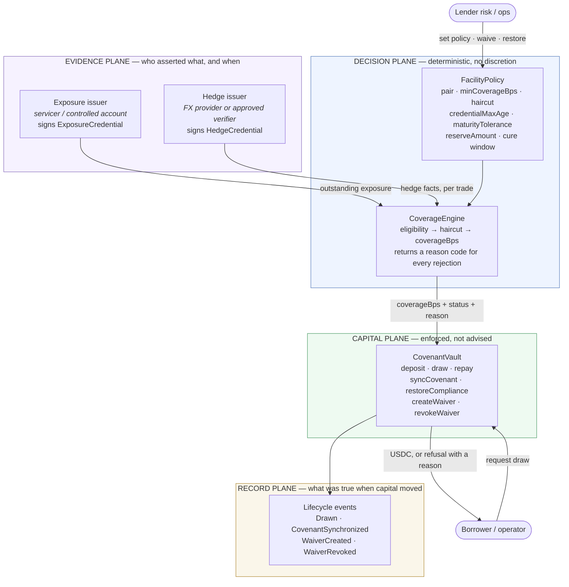
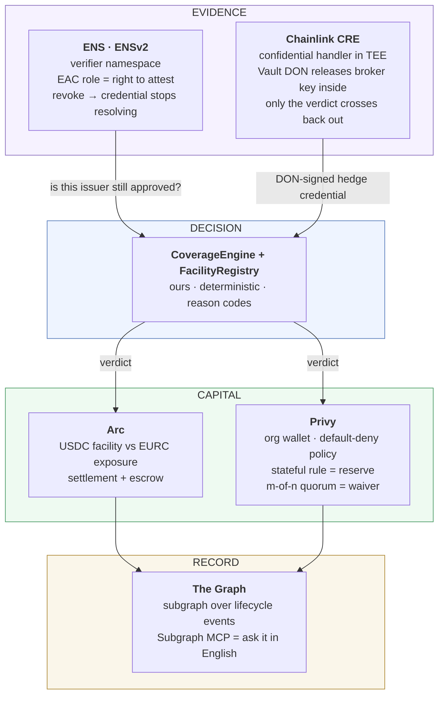
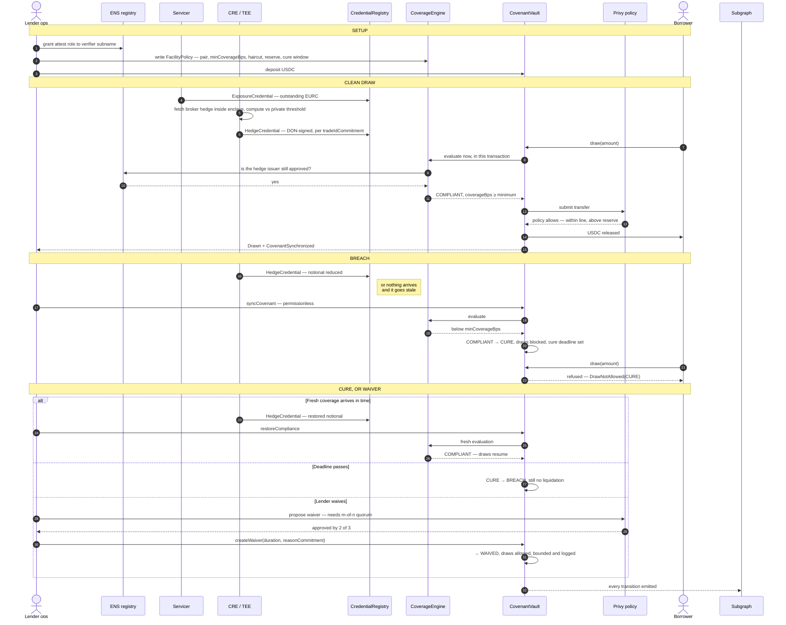

# System Architecture — end to end

**Created:** 2026-09-05
**Status:** Design. Layer 1 is built and locally tested; Layers 2 and 3 are specified, not deployed.
**Vocabulary:** taken verbatim from [PRODUCT-THESIS.md](./PRODUCT-THESIS.md) and [PROTOTYPE-SPEC.md](./PROTOTYPE-SPEC.md). No new terms are invented here.

Read this before building anything. It answers one question: **what happens, in order, between a hedge existing somewhere offchain and a dollar of USDC being allowed to leave a vault.**

---

## The machine in one line

> A facility owner writes a policy. Two independent parties assert facts. A deterministic engine turns those facts into a verdict. A vault obeys the verdict. Everything that happened is recorded.

Five parts, and the order is load-bearing. Remove any one and the product stops being a control layer: without the policy there is nothing to enforce, without independence the evidence is self-certified, without determinism the verdict is an opinion, without the vault it is a dashboard, and without the record it is unauditable.

---

## Layer 1 — the product machine, chain-agnostic

### The four invariants

1. **Independence.** The exposure issuer and the hedge issuer must be different parties. Enforced onchain — `FacilityRegistry` reverts with `IssuerRoleConflict`. A party that reports both the debt and its hedge can always report coverage.
2. **Fail closed.** Missing, stale, revoked, disputed, or insufficient inputs refuse the draw. Zero exposure yields `UNASSESSED`, never compliance.
3. **Fresh evaluation at the moment of capital movement.** `draw()` re-evaluates in the same transaction. Cached compliance cannot authorise capital, and time passing cannot restore it — `restoreCompliance()` needs current credentials.
4. **No excess credit.** `countedEligible = min(grossEligible, outstandingValue)`. Over-hedging is visible but never counted, so a facility cannot borrow against a hedge larger than its own book.

### What the machine deliberately does not do

It proves **which authorised party asserted a defined fact, when, and which deterministic rule followed.** It does not prove the legal existence, enforceability, valuation, or counterparty solvency of an offchain derivative. It never quotes, arranges or executes a derivative, never custodies margin or collections, never liquidates a borrower or seizes assets, and never treats a borrower's self-attestation as hedge evidence. A signer outage is handled only by a disclosed, time-bounded lender waiver.

---

## Layer 2 — the same machine, with the parts bound in

Each sponsor implements exactly one plane. Nothing is bolted on for prize eligibility.

| Part | What it does here | What breaks without it |
|---|---|---|
| **ENS** | Names the approved verifiers and holds the right to attest as a revocable EAC role | Approved-issuer lists become hardcoded addresses; withdrawing approval means a redeploy |
| **CRE** | Issues the hedge credential from inside a TEE, so the broker credential and the lender's private threshold never become public | The lender must publish its hedge book to make coverage verifiable — which no lender will do |
| **CoverageEngine** | Turns credentials + policy into `coverageBps`, a status and a reason code | The verdict becomes a human opinion, and the covenant is advisory again |
| **Arc** | Settles the facility: USDC capital against a real EURC exposure | The currency mismatch stays fictional and the demo proves nothing |
| **Privy** | Enforces the policy where money actually leaves, and makes waivers m-of-n | Reserve mechanics and waiver governance are ours to build and unilateral |
| **The Graph** | Makes the policy history answerable after the fact | Events exist but nobody can ask "was this draw released while uncovered?" |

**Two independent belts.** Note that the capital plane is enforced twice — onchain by `CovenantVault` and off-chain by the Privy policy at signing time. That redundancy is deliberate: the contract cannot be bypassed by an operator with a key, and the wallet cannot be bypassed by a contract bug.

---

## Layer 3 — one facility, end to end

The full Rube Goldberg run: funding, a clean draw, a breach, a cure, and a waiver.

**Where a human touches it:** writing the policy, granting or revoking a verifier's role, and approving a waiver. Nothing else. No human can talk the engine into a verdict, and the waiver — the one discretionary act — is quorum-approved, time-bounded, and carries a reason commitment.

---

## Trust and failure register

The part that makes it a control system rather than hopeful arrows: for every component, who is trusted, and what happens when it lies, is late, or is gone.

| Component | Trusted for | If it lies | If it is late | If it is unavailable |
|---|---|---|---|---|
| Exposure issuer | The facility's outstanding balance | Overstated exposure understates coverage → conservative; understated exposure overstates it → **unmitigated, the residual risk we accept and disclose** | Credential exceeds `credentialMaxAge` → `UNASSESSED` → draws refused | Draws refuse; repayment still works |
| Hedge issuer / CRE | Minimum hedge facts per trade | Cannot be detected onchain; mitigated by independence, approval, revocation and disclosure — never by cryptography | Stale → ineligible → coverage falls → `CURE` | Draws refuse; only a bounded waiver restores capacity |
| ENS registry | Who may attest today | Compromised parent could add a rogue verifier → registry admin is the lender's own key | Resolution lag is bounded by the credential's own freshness rule | Cached issuer set fails closed on the last known-good state |
| CoverageEngine | Deterministic math | It cannot lie — it is public, deterministic, and reason-coded | n/a | n/a |
| CovenantVault | Holding and gating capital | Contract bug is the real risk → Privy policy is the second, independent belt | n/a | Funds are stuck, not lost; no liquidation path exists |
| Privy policy | Refusing signature outside policy | TEE-enforced m-of-n; a single compromised key is insufficient | Pending intents held, not auto-approved | Onchain vault still enforces the covenant |
| Subgraph | History, not control | A wrong index misleads reporting but **cannot release capital** — the record plane has no authority | Indexing lag affects reporting only | Chain logs remain the source of truth |

**The honest gap:** an issuer that understates exposure, or a verifier that reports a hedge that does not exist, cannot be caught by this machine. The system proves provenance and enforces a rule — it does not audit reality. That boundary is stated in `PRODUCT-THESIS.md` and must stay in every demo and application, because the credibility of everything else depends on not overclaiming it.

---

## What is real today

| Layer | State |
|---|---|
| Coverage engine, credential registry, facility registry, vault | Built, 25 Solidity + 15 TS tests passing locally |
| Ebury-shaped provider adapter with fixtures | Built, mock payloads |
| Dashboard shell | Built, not wired to a live deployment |
| ENS verifier registry, CRE credential, Arc settlement, Privy policy, subgraph | **Specified here. None built.** |
| Any deployment | **None.** No contracts are live on any network |
